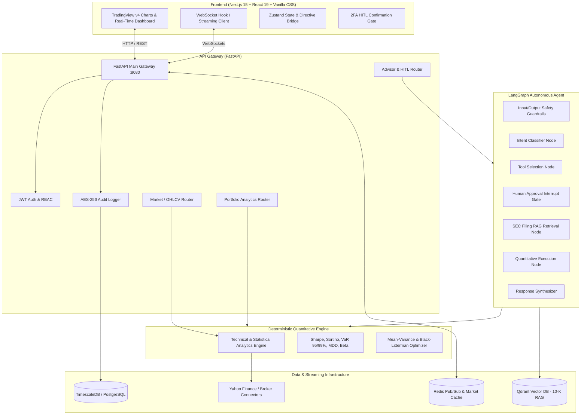

# 📈 Enterprise AI Financial Assistant & Portfolio Management Platform

An institutional-grade **AI Financial Advisor and Quantitative Analytics Platform** engineered for real-time market data visualization, autonomous technical and statistical analysis, SEC filing RAG retrieval, portfolio optimization, and MiFID II / SEC-compliant Human-in-the-Loop (HITL) transactional execution.

---

## 🏛️ System Architecture



---

## ✨ Key Features & Capabilities

### 1. 📊 Interactive TradingView Lightweight Charts (v4)
- **Multi-Asset Live Streaming**: Real-time candlestick updates via WebSockets for `AAPL`, `MSFT`, `GOOGL`, `NVDA`, and `SPY`.
- **Dynamic Timeframes**: `1D` (5m), `5D` (15m), `1M` (1d), `3M` (1d), `6M` (1d), `1Y` (1wk), and `YTD`.
- **Chart Styles**: Seamless toggle between `Candlestick`, `Area` (gradient fill), `Line`, and `Bar` (OHLC).
- **Interactive Crosshair Inspection**: Hover over any historical bar to inspect exact timestamps (`📅 YYYY-MM-DD`), Open, High, Low, Close, Volume, and % Change.
- **Configurable Indicator Parameters**: Tune `SMA Fast/Slow`, `EMA 9/21`, `Bollinger Bands Period & StdDev`, and `RSI Period` with instantaneous chart recalculation.
- **Custom Price Annotations**: Add and manage custom horizontal Support, Resistance, Target, and Stop-Loss price lines.
- **Snapshot Export**: One-click high-resolution PNG chart image download.

### 2. 🔬 Deterministic Technical & Statistical Analytics Engine
- **Momentum & Oscillators**: Wilder's RSI (14), Fast Stochastic (%K, %D), MACD (12, 26, 9) with histogram and crossover detection.
- **Trend & Moving Averages**: SMA 20, SMA 50, SMA 200, EMA 9, EMA 21, and Golden Cross / Death Cross monitors.
- **Volatility & Squeeze**: Bollinger Bands (20, 2.0σ), %B Bandwidth, and Average True Range (ATR-14).
- **Statistical Support, Resistance & Fibonacci**: Classical Pivot points (`Pivot`, `S1/S2/S3`, `R1/R2/R3`) and Fibonacci Retracement levels (`23.6%`, `38.2%`, `50.0%`, `61.8%`, `78.6%`).
- **Statistical Risk Distribution**: Current Price Z-Score, annualized volatility, skewness, excess kurtosis, and 1-day Historical Value-at-Risk (95% & 99% VaR).

### 3. 🤖 Context-Aware AI Advisor & Chart Directive Bridge
- **Bi-Directional Chatbot ➔ Chart Control**: When the AI advisor generates technical analysis, it emits structured **Chart Directives** that automatically switch the active asset, turn on indicator overlays, and draw calculated support/resistance lines on the TradingView chart.
- **Generic Active-Chart Queries**: Ask `"Analyze technicals on this chart"` or `"What are the key support and resistance levels?"` and the assistant automatically detects and analyzes whichever chart is currently open on screen.
- **Multi-Asset Comparative Ranking**: Ask `"Rank all watchlist assets by technical momentum"` to generate a sorted quantitative comparison across all equities.

### 4. ⚖️ Institutional Portfolio Optimization & Metrics
- **Risk-Adjusted Ratios**: Deterministic calculations of **Sharpe Ratio**, **Sortino Ratio**, **Max Drawdown (MDD)**, **CAGR**, and **Beta (vs. SPY)**.
- **Modern Portfolio Theory (MPT)**: Markowitz Mean-Variance Optimization for target volatility constraints.
- **Black-Litterman Model**: Bayesian blending of market equilibrium with investor views and confidence matrices.

### 5. 🛡️ MiFID II / SEC Regulatory Compliance & HITL 2FA
- **Human-in-the-Loop (HITL) Gate**: Transactional operations (rebalancing, order submission) automatically raise a `GraphInterrupt` and present a 2FA authorization modal before execution.
- **Audit Logging**: Every prompt, tool execution, and advisory response is logged with severity ratings, session IDs, and user cryptographic signatures.
- **Regulatory Disclaimers**: Automatic MiFID II and SEC suitability warnings, risk ratings, and compliance disclosures appended to every advisory response.

---

## 📁 Repository Structure

```text
.
├── backend/
│   ├── agents/                   # LangGraph AI Advisor agent graph & nodes
│   │   ├── nodes/                # Intent parsing, tool selection, RAG, synthesis, HITL
│   │   ├── tools/                # Portfolio, order, and SEC filing tools
│   │   ├── graph.py              # Compiled LangGraph StateGraph workflow
│   │   └── state.py              # AgentState TypedDict definitions
│   ├── gateway/                  # FastAPI API Gateway
│   │   ├── middleware/           # JWT Auth, AES audit logger, encryption
│   │   ├── routers/              # /advisor, /portfolio, /market, /orders
│   │   ├── schemas/              # Pydantic validation schemas (tools, compliance, portfolio)
│   │   └── main.py               # Gateway entrypoint & WebSocket routes
│   ├── quant/                    # Pure deterministic quantitative engine
│   │   ├── metrics.py            # Sharpe, Sortino, VaR, Max Drawdown, Beta
│   │   ├── optimization.py       # MPT Markowitz & Black-Litterman models
│   │   ├── technical.py          # Vectorized RSI, MACD, Bollinger, Pivots, Fibonacci
│   │   └── tests/                # Unit test suite for quantitative models
│   ├── rag/                      # SEC EDGAR RAG pipeline (Qdrant + BGE embeddings)
│   └── streaming/                # Market tick producer & WebSocket broadcaster
├── frontend/
│   ├── app/                      # Next.js 15 App Router pages & styles
│   │   ├── globals.css           # Premium Dark-Mode design system
│   │   └── page.tsx              # Main Financial Assistant dashboard
│   ├── components/
│   │   ├── charts/               # TradingViewChart.tsx (Lightweight Charts v4)
│   │   └── advisor/              # HITLConfirmationModal.tsx (2FA approval modal)
│   ├── hooks/                    # useWebSocket.ts (stabilized reconnection hook)
│   └── store/                    # portfolioStore.ts (Zustand state & chart directives)
├── infra/
│   └── timescaledb/init.sql      # Database schema for market ticks & audit logs
├── docker-compose.yml            # Production multi-container composition
├── docker-compose.dev.yml        # Development multi-container composition
├── pyproject.toml                # Python package configuration
└── README.md                     # Documentation
```

---

## 🚀 Quickstart & Launch Guide

### Prerequisites
- **Python**: `3.11` or higher
- **Node.js**: `20.x` or higher (`npm` or `pnpm`)
- **Docker & Docker Compose** (optional for containerized deployment)

---

### Option A: Local Development Launch (Recommended for Fast Iteration)

#### 1. Setup Backend Environment
```bash
# Clone repository
git clone git@github.com:aggelosflampouris-byte/Financial--Assistant.git
cd Financial--Assistant

# Create virtual environment
python3 -m venv .venv
source .venv/bin/activate

# Install backend dependencies
pip install -r backend/requirements.txt
```

#### 2. Start the Backend API Gateway
```bash
# Run FastAPI with hot-reloading on port 8080
PYTHONPATH=. .venv/bin/uvicorn backend.gateway.main:app --host 0.0.0.0 --port 8080 --reload
```

#### 3. Start the Next.js Frontend
In a new terminal window:
```bash
cd frontend

# Install Node dependencies
npm install

# Start Next.js dev server on port 3000
npm run dev
```

#### 4. Open the Platform
Navigate to **[http://localhost:3000](http://localhost:3000)** in your browser.

---

### Option B: Docker Compose Multi-Container Launch

To spin up the entire institutional stack (Gateway, Frontend, Redis, Qdrant, TimescaleDB):

```bash
# Start all microservices in detached mode
docker compose -f docker-compose.dev.yml up --build -d

# Verify all services are healthy
docker compose -f docker-compose.dev.yml ps
```

- **Frontend Dashboard**: [http://localhost:3000](http://localhost:3000)
- **API Gateway Swagger Docs**: [http://localhost:8080/docs](http://localhost:8080/docs)
- **Qdrant Vector DB Dashboard**: [http://localhost:6333/dashboard](http://localhost:6333/dashboard)

---

## 💬 Example Queries for the AI Financial Advisor

Try asking the assistant any of the following queries:

| Category | Example Prompt | Description |
| :--- | :--- | :--- |
| **Active Chart Analysis** | `"Analyze technical indicators, momentum, and statistical levels for the active chart"` | Automatically calculates RSI, MACD, Moving Averages, and plots S1/R1 price lines on the current stock. |
| **Multi-Asset Screening** | `"Compare all charts and rank watchlist assets by technical momentum"` | Runs batch quantitative screening and outputs a sorted ranking across `AAPL`, `MSFT`, `GOOGL`, `NVDA`, and `SPY`. |
| **Support & Resistance** | `"Show statistical support, resistance, and Bollinger Bands for NVDA"` | Calculates classical pivots, Fibonacci levels, and overlays horizontal lines on the chart. |
| **Portfolio Risk & Performance** | `"Show me my portfolio Sharpe ratio, Sortino, and Value at Risk"` | Queries the Quant Engine for annualized return, risk-adjusted performance, and 95% 1-day VaR. |
| **Portfolio Rebalancing** | `"Rebalance portfolio with 15% target risk using MPT"` | Formulates Markowitz mean-variance allocations and triggers the HITL 2FA approval flow. |
| **SEC EDGAR RAG** | `"What are Apple's principal risk factors in their latest 10-K filing?"` | Searches Qdrant dense vector embeddings for SEC report disclosures with citations. |

---

## 🧪 Running Unit Tests

Run the quantitative engine test suite to verify mathematical precision:

```bash
source .venv/bin/activate
pytest backend/quant/tests -v
```

---

## 🔒 Security & Compliance Architecture
- **MiFID II / SEC Disclaimers**: Algorithmic responses include mandatory compliance notices and suitability metadata.
- **Human-in-the-Loop (HITL)**: Autonomous trades cannot execute without signed confirmation tokens.
- **Cryptographic Audit Trail**: Critical financial operations are recorded with SHA-256 tamper verification.
- **Zero Hardcoded Secrets**: All configuration is injected via environment variables (`.env`).

---

## 📜 License
MIT License. Built for enterprise and institutional financial analysis.
